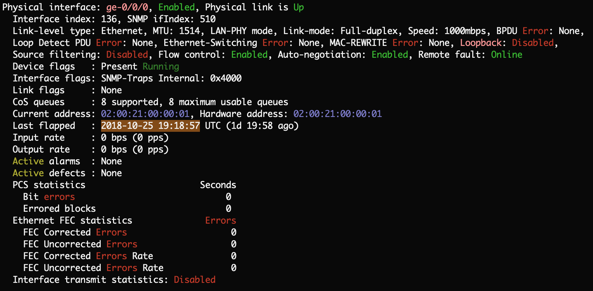

# ChromaTerm--

A tool for colorizing the output of a terminal.

-   [About](#about)
-   [Installation](#installation)
-   [Usage](#usage)
-   [Help](#help)

# About

ChromaTerm-- (`ct`) reads from standard input and highlights it according to user-configurable rules. Here's an example using the rules in the included configuration file:

# Installation

### HomeBrew

    brew install hSaria/tap/chromaterm
    curl https://raw.githubusercontent.com/hSaria/ChromaTerm--/master/.chromatermrc > ~/.chromatermrc

> You can uninstall with `brew uninstall chromaterm`

### Compile from Source

    git clone https://github.com/hSaria/ChromaTerm--.git
    cd ChromaTerm--/src/ && ./configure && make install

> You must have [PCRE2 or legacy PCRE](https://www.pcre.org) development installed. PCRE2 is recommended (much faster).
>
> You can uninstall with `make uninstall`

# Usage

By default, ChromaTerm-- reads a file at `~/.chromatermrc` which would have your highlight rules. As an example, run the following:

    echo "Jul 14 12:28:19: Message from 1.2.3.4" | ct

Think of ChromaTerm-- like `grep`; just pipe things into it. However, unlike other programs which line-buffer, `ct` works with interactive applications, like `ssh`. In fact, I have this in my .bash_profile `ssh() { /usr/bin/ssh $* | ct; }`.

> During installation, the default config file was copied to `~/.chromatermrc`; modify it to your liking.

## Highlight Rules

The syntax for a rule is `HIGHLIGHT {REGEX} {ACTION} {PRIORITY}`

#### REGEX

The RegEx engine used is [PCRE](https://www.pcre.org). If supported, PCRE2 is used (much faster).

#### ACTION

Once something matches the RegEx of a rule, the action of that rule is applied. The action can be a named (predefined) action or a custom one. Multiple actions can make up a single action as long as they are from the same category. For example: `{bold red}` or `{<fca><BAF>}`

The named actions are:

-   VT100: bold, dim, underscore, blink, b black, b blue, b cyan, b green, b magenta, b red, b white, b yellow, black, blue, cyan, white, and yellow.
-   xterm-256: b azure, b ebony, b jade, b lime, b orange, b pink, b  silver, b tan, b violet, azure, ebony, jade, light azure, light ebony, light jade, light lime, light orange, light pink, light silver, light tan, light violet, lime, orange, pink, silver, tan, and violet.

Terminals that support xterm-256 codes will support VT100 codes, as well.

To use a custom action, `man ct` has more info on that. Run `ct -d` to see the full range of colors.

#### PRIORITY

(Optional) If a part of the text is matched by two rules, the rule with the lower priority value overrides the action of the higher priority value; lower priority value = higher precedence. Default priority is 1000.

# Help

ChromaTerm-- includes a manual; check out `man ct`.

## Questions, Suggestions, or Bugs

Please open up an issue (always appreciated).
